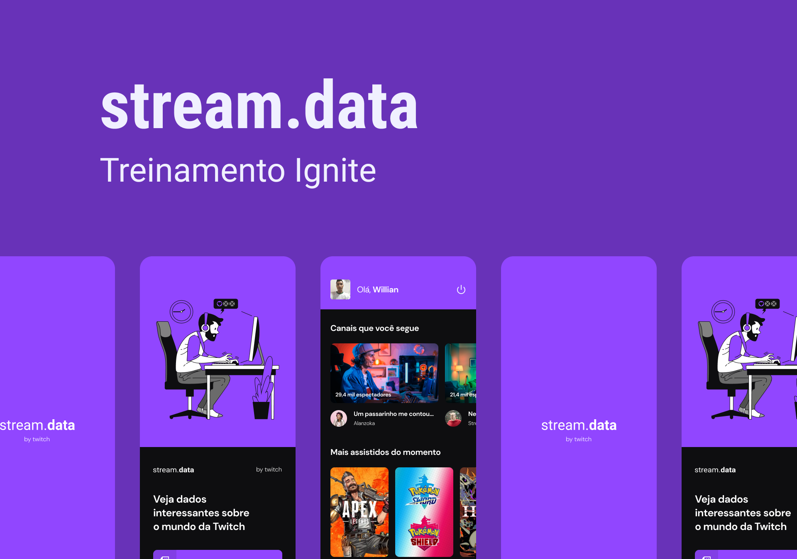

<h1 align="center">
    
</h1>

 

<h1 align="center">
  
</h1>

## 💻 Projeto

Está aplicação é o segundo desafio proposto, construída no segundo módulo do Ignite (Curso realizado pela [Rocketseat](https://rocketseat.com.br/)) na trilha de React Native. 
Onde o objetivo foi implementar todo o fluxo de login e logout utilizando o OAuth da Twitch. 

 

## 🚀 Tecnologias ultilizadas

- Este app foi criado com Bare Workflow, o qual possibilita criar aplicações **[React Native](https://reactnative.dev/)**, utilizando tanto as funcionalidades nativas do React Native como também as do **[Expo](https://docs.expo.io)**.

